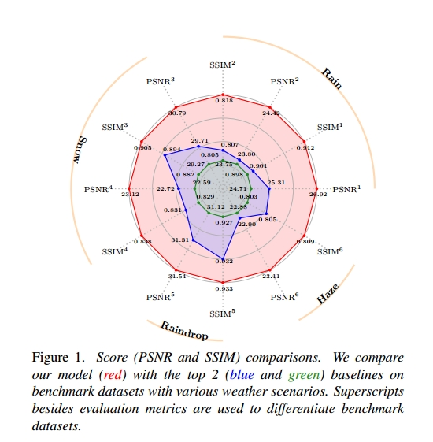
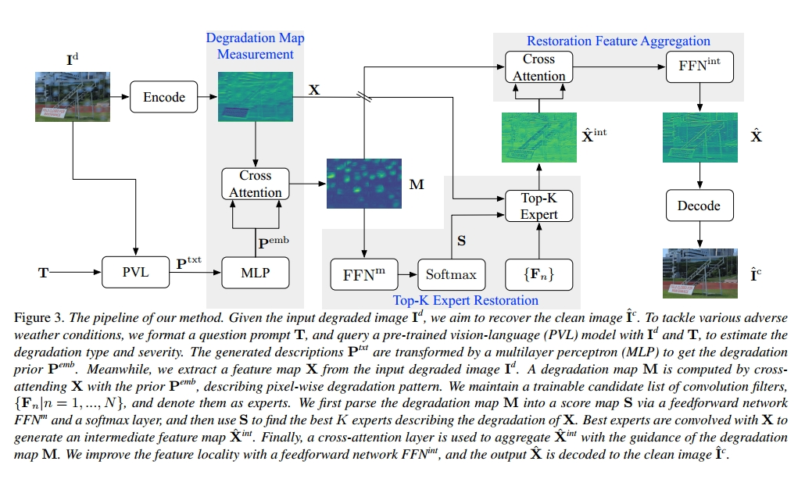

# Language-driven All-in-one Adverse Weather Removal


[This repository](https://github.com/noxsine/LDR) contains the PyTorch code for our paper "Language-driven All-in-one Adverse Weather Removal" by Hao Yang, Liyuan Pan, Yan Yang and  Wei Liang.

> [paper]() | [arxiv](https://arxiv.org/abs/2312.01381)


## Introduction


All-in-one (AiO) frameworks restore various adverse weather degradations with a single set of networks jointly. To handle various weather conditions, an AiO framework is expected to adaptively learn weather-specific knowledge for different degradations and shared knowledge for common patterns. However, existing methods: 1) rely on extra supervision signals, which are usually unknown in real-world applications; 2) employ fixed network structures, which restrict the diversity of weather-specific knowledge. In this paper, we propose a Language-driven Restoration framework (LDR) to alleviate the aforementioned issues. First, we leverage the power of pre-trained vision-language (PVL) models to enrich the diversity of weather-specific knowledge by reasoning about the occurrence, type, and severity of degradation, generating description-based degradation priors. Then, with the guidance of degradation prior, we sparsely select restoration experts from a candidate list dynamically based on a Mixture-of-Experts (MoE) structure. This enables us to adaptively learn the weather-specific and shared knowledge to handle various weather conditions (e.g., unknown or mixed weather). Experiments on extensive restoration scenarios show our superior performance .


<div align=center>

</div>

## Framework

<div align=center>

</div>

## Requirements

Please refer to [requirements.txt](./src/basicsr/requirements.txt).

## How to run

```bash
python main.py -opt Test.yml
```


## Citation

```
@inproceedings{yang2024language,
  title={Language-driven All-in-one Adverse Weather Removal},
  author={Yang, Hao and Pan, Liyuan and Yang, Yan and Liang, Wei},
  booktitle={Proceedings of the IEEE/CVF Conference on Computer Vision and Pattern Recognition},
  pages={24902--24912},
  year={2024}
}
```

## Acknowledgement
The code is borrowed from the following repositories, thanks for sharing.
- [HINet](https://github.com/megvii-model/HINet)
- [BasicSR](https://github.com/xinntao/BasicSR)
- [Restormer](https://github.com/swz30/Restormer)
- [SFNet](https://github.com/c-yn/SFNet)
- [DRSformer](https://github.com/cschenxiang/DRSformer)


